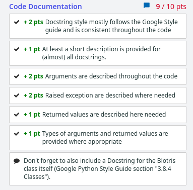
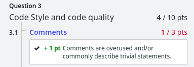
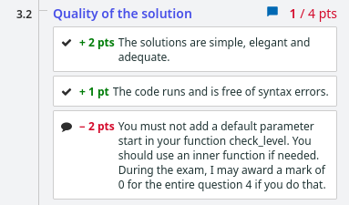
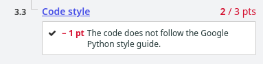

For this I got 80/80 autograded, 9/10 for Code Documentation and 4/10 for Code Style and Quality.

Reason for missing code documentation mark: Lack of docstring on Q5 Blotris class.

## Code Style and Quality

